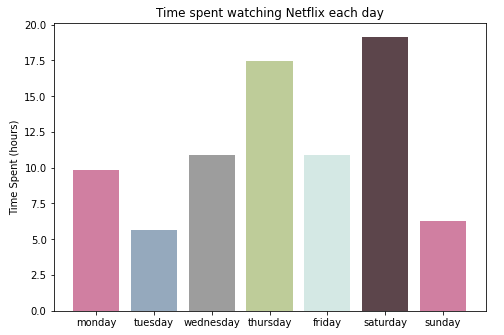
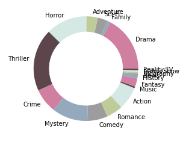
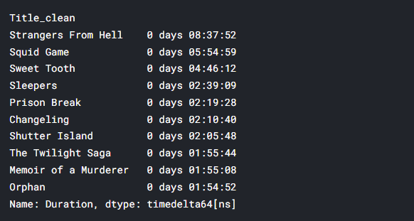

# AnalysingNetflixData
Decided to practice data cleaning and data analytics with my personal Netflix data
 
Kaggle Notebook: <a href='https://www.kaggle.com/jolenech/analysing-netflix-data/notebook'>https://www.kaggle.com/jolenech/analysing-netflix-data/notebook</a>

## Analytics & Visualisations
Time spent watching Netflix according to the days of the week. Looks like I watched Netflix the most on Saturdays!
 

 
 
Finding my favourite genres by using a third-party API from rapidAPI, the IMDB API to get the genres with the titles of the movies. My top 3 genres below!
 

 
 
Here's a piechart/donut view of the genres of movies/shows I watch!
 

 
 
I also found my top 10 most watched shows using the total durations of each show.
 
